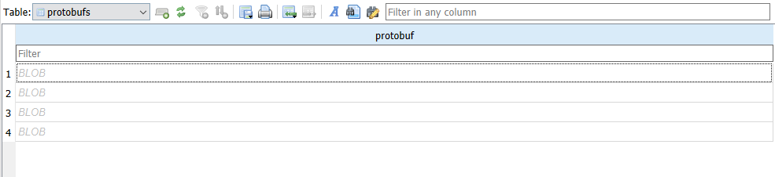
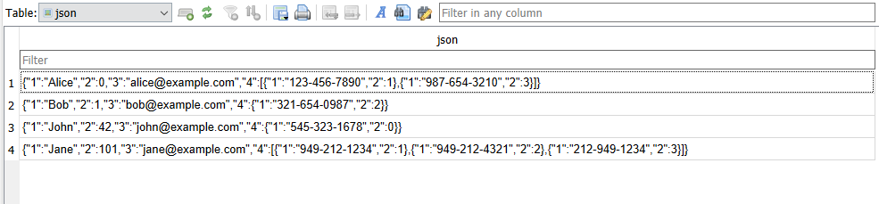
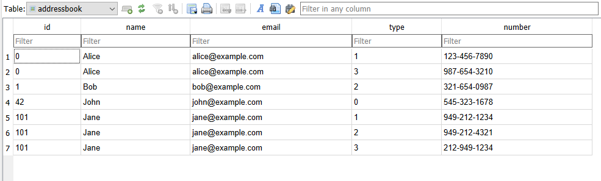

# Example: address book
The `AddressBook.sqlite` contains a demonstration of how the SQLite together with the `sqlite_protobuf` extension can be used to store and process raw protobuf data. 

## Raw protobuf data
The `protobufs` table contains the raw serialized protobuf data as a binary blob. 

For this example each entry is corresponds to a person, generated using the `person.proto` given below:

```protobuf
syntax = "proto2";

message Person {
  optional string name = 1;
  optional int32 id = 2;
  optional string email = 3;

  enum PhoneType {
    PHONE_TYPE_UNSPECIFIED = 0;
    PHONE_TYPE_MOBILE = 1;
    PHONE_TYPE_HOME = 2;
    PHONE_TYPE_WORK = 3;
  }

  message PhoneNumber {
    optional string number = 1;
    optional PhoneType type = 2 [default = PHONE_TYPE_HOME];
  }

  repeated PhoneNumber phones = 4;
}
```
It is not nessisary to know the `person.proto` file to be able to use the `sqlite_protobuf` extension, however it can be usfull when making sense of the decoded protobuf data. 

## Viewing JSON representation of the protobuf data
The `sqlite_protobuf` extension can be used to generate a human readable `JSON` representation of the data. 
In the the `AddressBook.sqlite` file we have created this as a SQLite `VIEW` of the json representation of the protobuf data using the following query:
```sql
CREATE VIEW json AS SELECT protobuf_to_json(protobuf) AS json FROM protobufs
```

## Creating custom views of the protobuf data
The `sqlite_protobuf` extension can be used to create custom views of the sqlite data for example it might be useful to create a table containing one entry for each phone number in the address book. 
In the the `AddressBook.sqlite` file we have created this custom SQLite `VIEW` of the protobuf data using the following query:
```sql
CREATE VIEW addressbook as
SELECT 
	protobuf_extract(protobuf, '$.2', 'int32') as id,
	protobuf_extract(protobuf, '$.1', 'string') as name,
	protobuf_extract(protobuf, '$.3', 'string') as email,
	protobuf_extract(value, '$.2', 'enum') as type,
	protobuf_extract(value, '$.1', 'string') as number
FROM protobufs, protobuf_each(protobuf, '$') WHERE field = 4
```
Note that this query is based on the definition found in the `person.proto` file given above, and we can map the extracted fields to fields given in the protobuf definition.